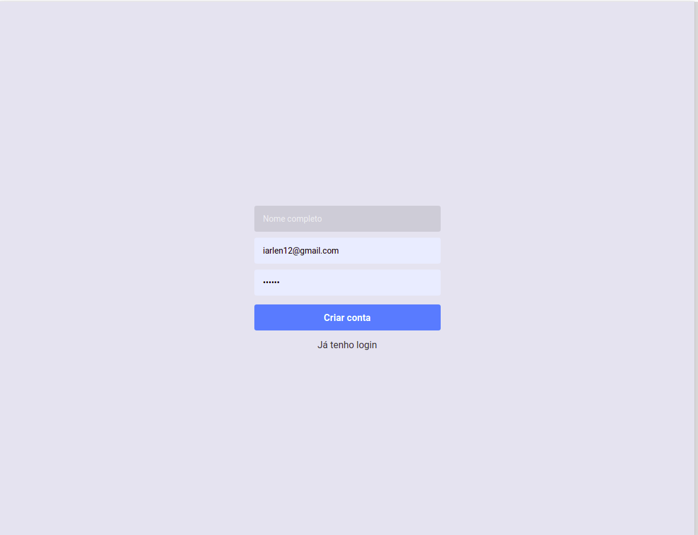
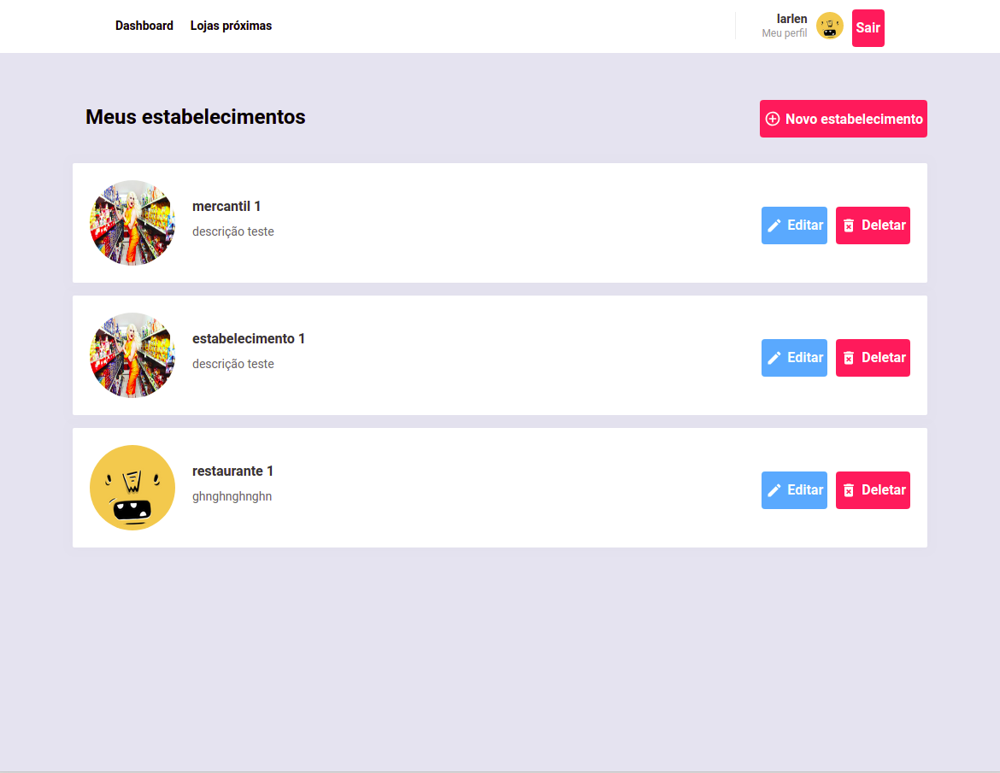
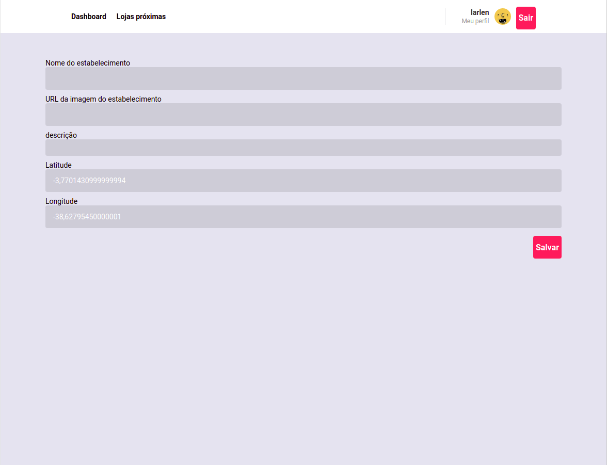
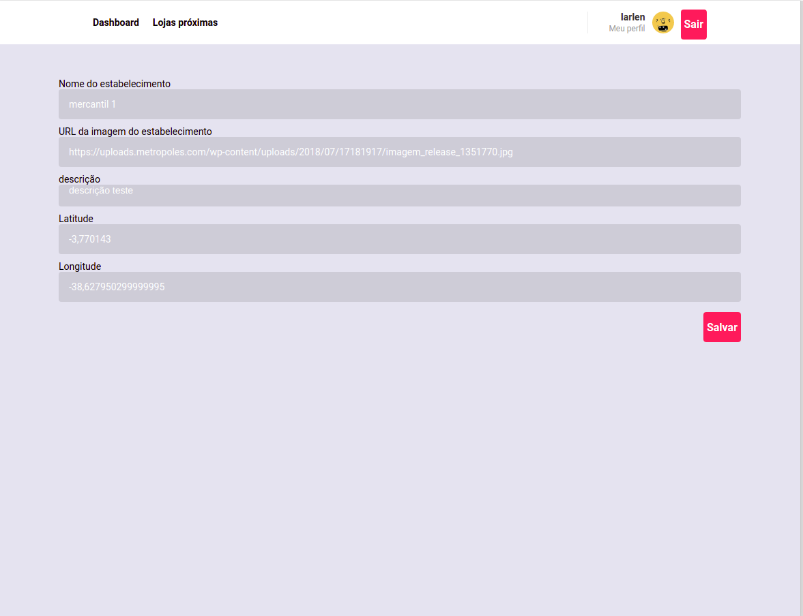
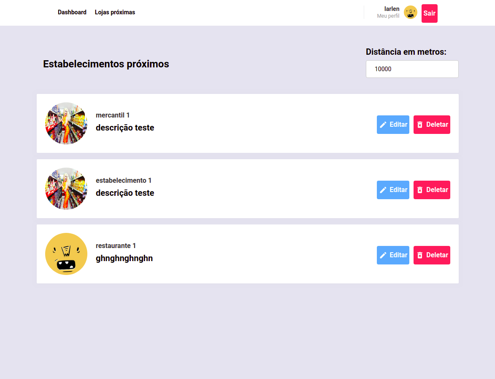

# :computer: Aplicação Web em ReactJS para getenciar estabelecimentos

## Tecnologias

- Axios
- History
- Immer
- Polished
- PropTypes
- Redux
- Redux Saga
- React Toastify
- Reactotron
- Styled Components
- Yup
- ESLint
- Prettier

## Run

- git clone
 - yarn
 - yarn start
